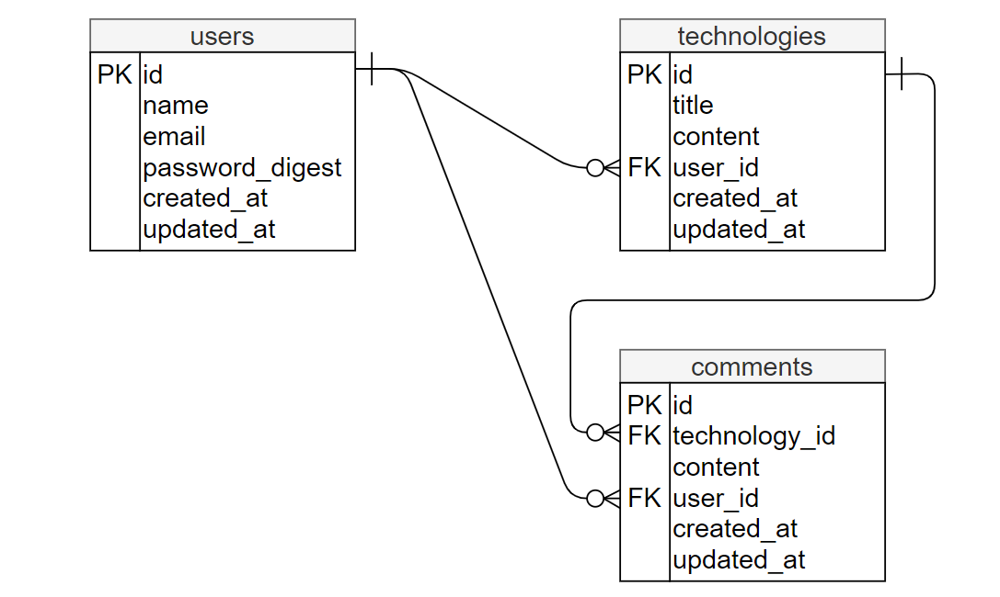

# README

### (1)アプリケーション(建設技術投稿サイト)の概要  
建設業界で働いている方をターゲットとし、建設関係の技術情報を投稿し共有することで、新たな気付きを得たり知見を広めることを目的としたアプリケーションです。  

### (2)アプリケーションで使っている技術  
・開発環境　→　AWS cloud9  
・フロントエンド　→　HTML、CSS、Bootstrap  
・バックエンド　→　Ruby(2.5.3)、Ruby on Rails(5.2.4.4)  
・データベース　→　MySQL(5.5.62)  
・バージョン管理システム　→　GitHub  
・インフラ　→　heroku  

### (3)環境構築手順  
1.git clone https://github.com/yuuhei-koutoku/cts.git  
2.cd environment/portfolio/cts  
3.bundle install  
4.bundle exec rails db:create  
5.bundle exec rails db:migrate  
6.bundle exec rails s  

### (4)デプロイ方法  
1.git push origin master  
2.git push heroku master  

### (5)アプリケーションの機能  
・ユーザー登録機能（アカウント作成）  
・ログイン機能  
・文章を投稿する機能  
・画像を投稿する機能（Active Storage、ImageMagickを使用）  
・投稿に対してコメントを書く機能  

### (6)テーブルの概要  
1.users・・・ユーザーを管理する。  
2.technologies・・・技術情報を投稿する。Userに紐付いている。  
3.comments・・・一つの技術情報の投稿に対してコメントを送ることが出来る。Technologyに紐付いている。  
4.active_storage_attachments・・・ActiveStorageで使用する。  
5.active_storage_blobs・・・ActiveStorageで使用する。  

### (7)リレーション  

